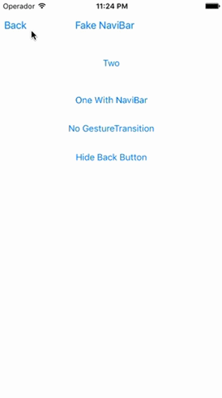

### 解决的问题
* 可选是否需要滑动返回手势
* 可选是否隐藏左侧返回按钮
* 解决连续快速 push 和 pop 可能会出现导航条崩溃的情况
* 解决连续两个隐藏导航条的控制器, 在第二个隐藏导航条的控制器使用手势返回, 但右划距离不足以返回上一个控制器时松手, 这时候如果返回到一个显示导航条的控制器,再 push 出一个带导航条的控制器,这个控制器的导航条显示会出现混乱, 表现是最终显示上一个导航栏的内容

#### 问题示例
* 快速push 或 pop 时可能引起的导航控制器崩溃

	

* 导航条错误显示的问题

	

### 使用方法
由于在分类中为`UIViewController`增加了几个属性,为了使用方便,建议在 pch 文件中导入头文件
